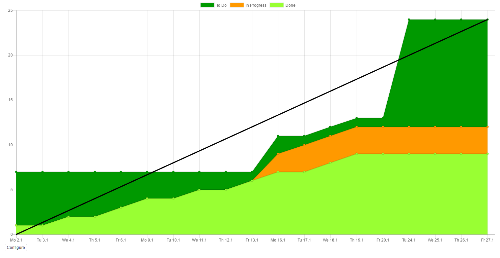

# Installation
Download the extension via the [Chrome Webstore](https://chrome.google.com/webstore/detail/jira-cumulative-flow-diag/dbjnljpnlpkaemdjgkblcokahlnglkja?hl=de) or [Firefox Add-ons](https://addons.mozilla.org/en-US/firefox/addon/cumulative-flow-diagram/).

# Usage
## Create a diagram
1. Login to Jira
2. Click on the icon  that was installed in your URL bar.
3. Enter your desired configuration in the JSON notation. See the Options section below for further details about the configuration options. The configuration might look like the following:
```json
{
  "jiraUrl": "https://jira-cfd.atlassian.net/",
  "jiraQuery": "project = CFDTES",
  "jiraFilter": 12345,
  "startDate": "2020-04-02",
  "endDate": "2020-04-28",
  "nonWorkingDays": [
    "2020-04-13"
  ],
  "states": [
    {
      "state": "Done",
      "color": "rgba(153,255,51,1)"
    },
    {
      "state": "In Progress",
      "color": "rgba(255,153,0,1)"
    },
    {
      "state": "To Do",
      "color": "rgba(0,153,0,1)"
    }
  ]
}
```
4. Click on the "Create Chart" button to finally create the chart.
5. The created link can be shared. Everyone with the extension installed and logged into Jira should be able to open the diagram.
6. The created diagram might look like the following:


## Options
| Option | Description |
| --- | --- |
| jiraUrl | The URL of Jira. It will be used to access Jira's REST API. |
| jiraBoard | The id of a Jira board with one active sprint on which the diagram should be based on. The query, start date and end date are used. The query, start- and enddate get overwritten by the specific options described below. |
| jiraSprint | The id of the Jira sprint the diagram should be based on. The query, start date and end date are used. The query, start- and enddate get overwritten by the specific options described below. |
| jiraQuery | The Jira query the diagram should be based on. The jiraQuery or the jiraFilter should be specified. |
| jiraFilter | The id of the Jira filter the diagram should be based on. The jiraQuery or the jiraFilter should be specified. |
| startDate | The first day included in the diagram. |
| endDate | The last day included in the diagram. |
| nonWorkingDays | A list of days that should be excluded. Weekends are excluded by default. |
| states | The list of states that should be displayed. The list is orderd. |
| states.state | The name of the Jira state. |
| states.color | The color that should be used for the issues in this state. |

# Development
1. Clone Repo
2. Install Node.js
3. Run: npm install
4. To create a development build execute: npm run build
5. To create a production build exeucte: npm run build-production
6. Install addon/addon.zip in Chrome/Firefox

# Credits
Icon made by [Maxim Basinski](http://www.flaticon.com/authors/maxim-basinski) from [Flaticon](http://www.flaticon.com).